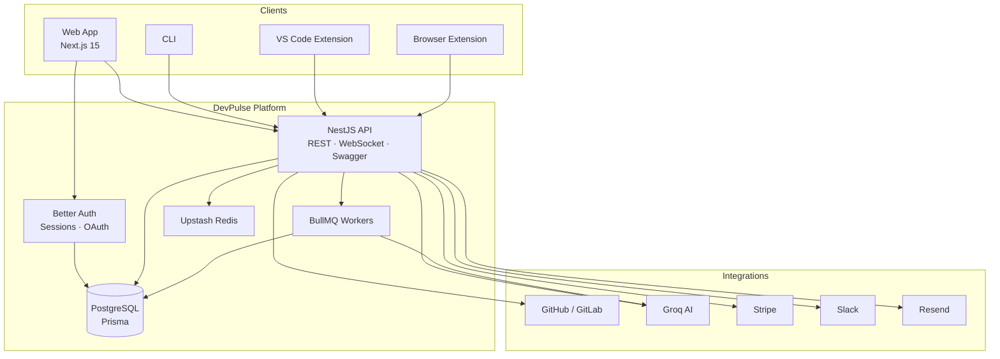
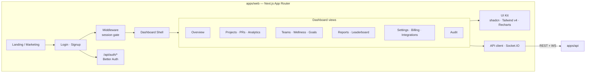
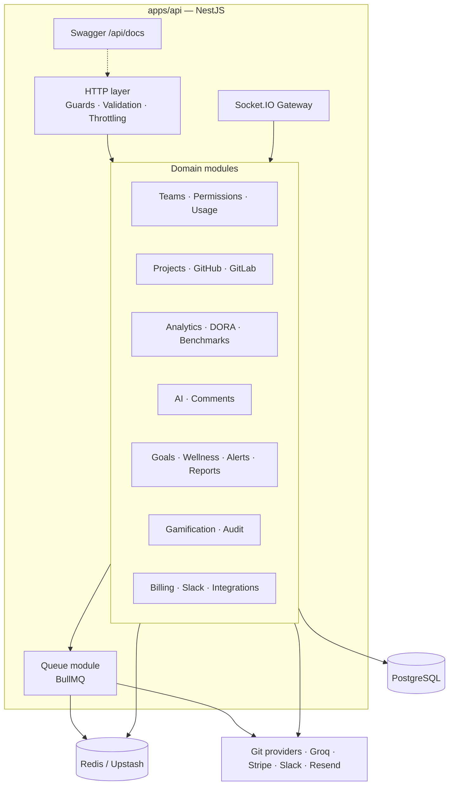
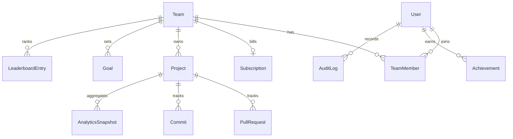

# DevPulse

**Engineering analytics for modern development teams.**

DevPulse turns GitHub and GitLab activity into actionable delivery insights — DORA metrics, PR health, AI-assisted reviews, team wellness, and billing-ready SaaS controls — in one dashboard.

[](https://www.typescriptlang.org/)
[](https://nextjs.org/)
[](https://nestjs.com/)
[](https://www.prisma.io/)
[](https://pnpm.io/)

---

## Why DevPulse

Engineering leaders need more than raw commit counts. DevPulse connects to your repositories, syncs pull requests and commits, and surfaces the signals that matter:

- **Delivery health** — review time, merge rate, velocity, contributor activity
- **DORA metrics** — deployment frequency, lead time, change failure rate, recovery
- **AI assistance** — PR analysis, standup summaries, sprint insights (Groq)
- **Team operations** — goals, wellness signals, leaderboards, audit logs
- **SaaS-ready** — teams, roles, Stripe billing, usage limits, Slack alerts

---

## Features

| Area | Capabilities |
|------|----------------|
| **Source control** | GitHub & GitLab sync, webhooks, optional GitHub App |
| **Analytics** | Metrics, contributors, velocity, review time, timelines, DORA |
| **AI** | PR quality analysis, standup generation, batch insights |
| **Collaboration** | Teams, RBAC (`owner` / `admin` / `member` / `viewer`), PR comments |
| **Operations** | Goals, wellness, anomaly alerts, scheduled reports (Resend) |
| **Realtime** | Socket.IO activity feed |
| **Billing** | Stripe Checkout + Customer Portal (Free / Pro / Enterprise) |
| **Ecosystem** | CLI, VS Code extension, browser extension (GitHub PRs) |
| **PWA** | Installable dashboard with offline fallback |

---

## Architecture

### System overview



### Frontend architecture



**Frontend stack highlights**

- Next.js 15 (App Router) + React 19 + TypeScript
- Better Auth (email/password + GitHub OAuth)
- Tailwind CSS v4, shadcn/ui, Lucide icons, Recharts
- Socket.IO client for live activity
- PWA support via `@ducanh2912/next-pwa`

### Backend architecture



**Backend stack highlights**

- NestJS 11, Swagger, class-validator, rate limiting
- Prisma 6 + PostgreSQL (shared `@devpulse/database` package)
- Octokit / GitBeaker for source sync
- Groq for AI workloads
- Stripe, Slack Bolt, Resend
- BullMQ for background jobs; Upstash Redis for cache

### Data model (core)



---

## Monorepo structure

```text
devpulse/
├── apps/
│   ├── web/                 # Next.js dashboard + landing
│   └── api/                 # NestJS API + seed scripts
├── packages/
│   ├── database/            # Prisma schema & client
│   ├── cli/                 # `devpulse` CLI
│   ├── vscode/              # VS Code extension
│   └── browser-ext/         # Chrome MV3 extension
├── docs/                    # Feature & cost notes
└── package.json             # Turborepo + pnpm workspace
```

---

## Tech stack

| Layer | Technology |
|-------|------------|
| Monorepo | Turborepo, pnpm workspaces |
| Frontend | Next.js 15, React 19, Tailwind CSS 4, shadcn/ui |
| Auth | Better Auth (credentials + GitHub OAuth) |
| Backend | NestJS 11, Socket.IO, BullMQ |
| Database | PostgreSQL, Prisma 6 |
| Cache / jobs | Upstash Redis, BullMQ |
| AI | Groq |
| Payments | Stripe |
| Notifications | Slack, Resend |
| Tooling | TypeScript, ESLint, Turbo |

---

## Getting started

### Prerequisites

- Node.js 20+
- pnpm 9+
- PostgreSQL database
- GitHub PAT (for sync / seed)
- Optional: Redis, Groq, Stripe, Slack, Resend keys for full features

### Install

```bash
pnpm install
```

### Environment

Create env files from your deployment secrets (no committed `.env` files):

**`apps/web/.env.local`** (local)

```env
DATABASE_URL=
BETTER_AUTH_SECRET=
BETTER_AUTH_URL=http://localhost:3000
NEXT_PUBLIC_API_URL=http://localhost:3001
NEXT_PUBLIC_APP_URL=http://localhost:3000
GITHUB_CLIENT_ID=
GITHUB_CLIENT_SECRET=
NEXT_PUBLIC_STRIPE_PUBLISHABLE_KEY=
```

**Production web (Vercel)** — also mirrored in `apps/web/.env.production`:

| Variable | Value |
|----------|--------|
| `NEXT_PUBLIC_APP_URL` | `https://dev-pulse-seven-livid.vercel.app` |
| `BETTER_AUTH_URL` | `https://dev-pulse-seven-livid.vercel.app` |
| `NEXT_PUBLIC_API_URL` | your deployed API URL |
| `DATABASE_URL` / `BETTER_AUTH_SECRET` / GitHub OAuth | set in Vercel → Settings → Environment Variables |

**`apps/api/.env`**

```env
PORT=3001
WEB_URL=https://dev-pulse-seven-livid.vercel.app
CORS_ORIGINS=http://localhost:3000,https://dev-pulse-seven-livid.vercel.app
DATABASE_URL=
DIRECT_URL=
GITHUB_PAT=
GROQ_API_KEY=
UPSTASH_REDIS_REST_URL=
UPSTASH_REDIS_REST_TOKEN=
REDIS_URL=
STRIPE_SECRET_KEY=
STRIPE_WEBHOOK_SECRET=
STRIPE_PRO_PRICE_ID=
STRIPE_ENTERPRISE_PRICE_ID=
RESEND_API_KEY=
# Optional: GitHub App, Slack, GitLab
```

### Database

```bash
pnpm db:generate
pnpm db:push
```

### Run locally

```bash
# API — http://localhost:3001  ·  Swagger /api/docs
pnpm --filter @devpulse/api start:dev

# Web — http://localhost:3000
pnpm --filter @devpulse/web dev
```

Or from the root:

```bash
pnpm dev
```

### Seed demo data (optional)

Syncs real public GitHub repositories into a demo team (requires `GITHUB_PAT`):

```bash
pnpm --filter @devpulse/api seed
```

---

## API surface

| Concern | Notes |
|---------|--------|
| Base URL | `http://localhost:3001` |
| Docs | Swagger UI at `/api/docs` |
| Auth | Session cookie or `Authorization: Bearer <token>` |
| Realtime | Socket.IO namespace `/events` |
| Webhooks | `POST /github/webhook`, Stripe + Slack event routes |

---

## Roles & access

| Role | Intent |
|------|--------|
| **Owner** | Full team control, billing, destructive actions |
| **Admin** | Manage members, projects, integrations |
| **Member** | Day-to-day project & analytics access |
| **Viewer** | Read-only dashboards |

---

## Scripts

| Command | Description |
|---------|-------------|
| `pnpm install` | Install workspace dependencies |
| `pnpm dev` | Run apps via Turbo |
| `pnpm build` | Production build |
| `pnpm lint` / `pnpm typecheck` | Quality checks |
| `pnpm db:generate` / `pnpm db:push` | Prisma generate & schema push |
| `pnpm --filter @devpulse/api seed` | Seed real GitHub demo data |
| `pnpm cli:build` | Build the DevPulse CLI |

---

## Design principles

- **Real data first** — analytics are derived from synced repository activity, not fake metrics
- **Graceful degradation** — integrations are env-gated; core product runs without every key
- **Clear boundaries** — web owns auth UX; API owns domain logic, sync, and billing webhooks
- **Shared types via Prisma** — one schema package consumed by web and API

---

## Roadmap ideas

- Deeper CI/CD deployment tracking for DORA
- Full background AI / report worker coverage
- Enterprise SSO and advanced org controls
- Mobile-optimized PWA push notifications

---

## License

Private / unlicensed unless otherwise stated by the repository owner.

---

Built as a full-stack SaaS portfolio product — TypeScript monorepo, production-shaped auth, billing, analytics, and AI integrations.
